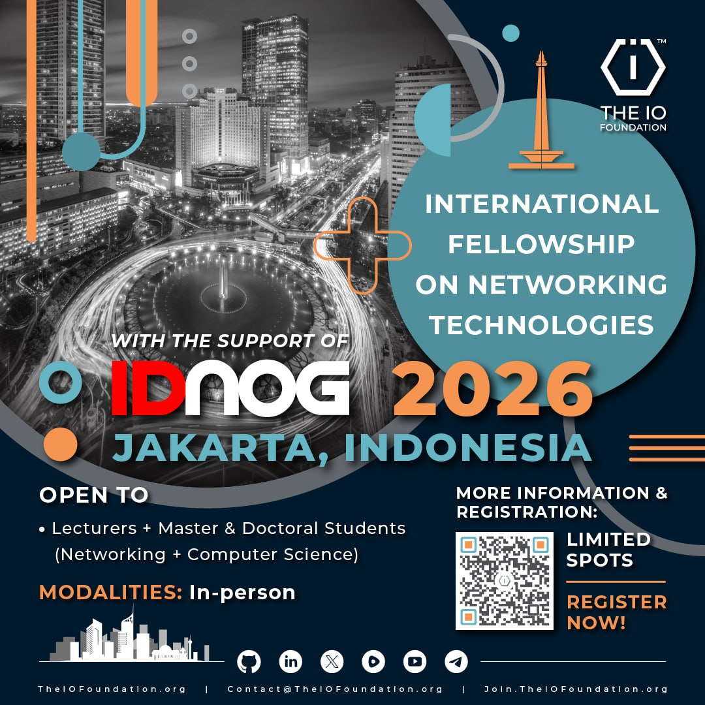

# \[#IDNOG] TU Fellowship IDNOG 2026



{% column width="58.333333333333336%" %}
### About

The IO Foundation, supported by the Indonesian Network Operators Group (IDNOG) is seeking 5 passionate and dedicated individuals from the academic community to join our exclusive Fellowship cohort for the upcoming IDNOG 2026 Masterclasses and Workshops.

This year’s technical tracks will be held at the Mercure Jakarta Grogol from 20th to 22nd July 2026.


## NOTICE

⚠️ Important Scope Limitation: Please note that this specific fellowship grants full, complimentary access strictly to the intensive technical Workshops / Masterclasses.

It does not cover entry to the main IDNOG general conference sessions.

Check the [Timeline](tiof-tu-fellowship-idnog-2026.md#timeline) below for more details.


### Understanding the IDNOG Workshop Ecosystem

IDNOG serves as the primary meeting ground for the engineers, operators and architects who build and maintain Indonesia's Internet infrastructure. While the main conference focuses on high-level industry presentations, the Workshops & Masterclasses are where the actual engineering happens.

For academia and advanced researchers, these tracks offer a rare, hands-on deep dive on the following topics:

* FTTH to DWDM–OTN Transport Network Design (Next generation DWDM)
* Routing Architecture Mastery : Deep Dive OSPF, BGP, IPv4 & IPv6 Transition in Production Networks
* BGP Deployment Workshop
* VXLAN EVPN For Data Center Network Workshop
* Cybrey Firewall: Secure but Easy – Mastering AI-Powered Next-Generation Security

#### The Fellowship will include:

* Full Complimentary Access: A sponsored seat in **one** of IDNOG’s multi-day technical workshop tracks listed above.
* Networking: Opportunity to interact, troubleshoot and network with senior network operators and industry pioneers.

### Why Join This Fellowship?

The modern Internet infrastructure landscape demands a blend of rigorous academic methodology and deep, practical deployment knowledge.

* **For Lecturers & Researchers**\
  Bring production-grade network engineering back to the classroom. Update your curriculum with the latest industry best practices in routing, transport network designs and data center frameworks, ensuring your students graduate industry-ready.
* **For Masters and Doctoral Students**\
  This fellowship gives you the high-level infrastructure mastery needed to solve immediate, complex bottlenecks at your workplace, while providing a rich source of empirical data and case studies for your thesis or dissertation.


## **Enhance Your Professional Portfolio**

Gaining hands-on exposure within the IDNOG community provides a unique, highly respected distinction on CVs for both academic tenure and corporate leadership paths.



{% column width="41.666666666666664%" %}
<p align="center"><a href="https://short.theiofoundation.org/TIOF-TU-Fellowship-IDNOG-2026-registration" class="button primary" data-icon="tickets">APPLY NOW</a></p>

<div align="center"><figure><figcaption></figcaption></figure></div>

<div align="center"><figure><figcaption></figcaption></figure></div>


## **SUBMISSION DEADLINE**

**FRIDAY, 3rd JULY**\
**2026 - 23:59 (UTC+00)**



## FELLOWSHIP ANNOUNCEMENT

**Friday, 10th JULY 2026**

<a class="button primary" data-icon="people-pants">Meet the Fellows</a>



## WHO SHOULD APPLY?

This program is exclusively tailored for individuals within higher education who have a strong foundation or focus on networking, data centers, systems or cybersecurity:

* Active Lecturers / Researchers in Computer Science, Information Technology, Computer Engineering or related telecommunication fields.
* Current Master’s (S2) Students looking to align their professional tech careers and academic research with industry standards.
* Current Doctoral (S3) Candidates focusing on advanced internet architecture, protocol design or network security.

> _Note: Selected fellows will be required to submit proof of active academic status (e.g., Lecturer ID, active student enrollment certificate or official university letter)._





## Contact Us for more info:

* **Email:** [Contact@TheIOFoundation.org](mailto:Contact@TheIOFoundation.org?subject=Reaching%20out%20from%20the%20website.)​
* ​**Telegram:** [@TIOFContact](https://t.me/TIOFContact)


## Available Workshops

You can participate in <mark style="color:$warning;">**ONE**</mark> of these workshops below:\
(In the registration you will be able to select your order of preference.)

* **20-22 July 2026:** [Routing Architecture Mastery: Deep Dive OSPF, BGP, IPv4 & IPv6 Transition in Production Networks](https://www.idnog.or.id/program/routing-architecture-mastery-:-deep-dive-ospf,-bgp,-ipv4-&-ipv6-transition-in-production-networks)
* **20-22 July 2026:** [VXLAN EVPN For Data Center Network Workshop](https://www.idnog.or.id/program/vxlan-evpn-for-data-center-network-workshop)
* **20-21 July 2026:** [FTTH to DWDM–OTN Transport Network Design (Next generation DWDM)](https://www.idnog.or.id/program/ftth-to-dwdm%E2%80%93otn-transport-network-design-\(next-generation-dwdm\))
* **20-22 July 2026:** [BGP Deployment Workshop](https://www.idnog.or.id/program/bgp-deployment-workshop)
* **20-21 July 2026:** [Cybrey Firewall: Secure but Easy – Mastering AI-Powered Next-Generation Security](https://www.idnog.or.id/program/cybrey-firewall:-secure-but-easy-%E2%80%93-mastering-ai-powered-next-generation-security)


## LIMITED SPOTS

**APPLY BY: FRIDAY, 3RD JULY 2026 23:59 (UTC+00)**   <a href="https://short.theiofoundation.org/TIOF-TU-Fellowship-IDNOG-2026-registration" class="button primary" data-icon="tickets">APPLY NOW</a>


## **Terms of Reference**

Applicants must understand and abide by the following:



### **Requirements**

* [x] <mark style="color:$warning;">Able to follow the multiday Workshop in-person actively and until completion</mark>
* [x] Possess a suitable academic background or professional experience in networking/computer science to actively participate in high-level technical sessions
* [x] Ability to work independently and collaboratively in dynamic environments


## Recommendation Letter Requirement

You are required to upload a formal Recommendation Letter from your faculty. The letter must explicitly state:

* Your chosen IDNOG workshop tracks.
* That you possess the suitable academic background or professional experience required to actively participate in high-level technical sessions.
* A guarantee of your commitment to attend the full duration of the workshop.
* An acknowledgment that you will cover your own accommodation and travel expenses, if applicable.






* [x] Passion for and commitment to The IO Foundation's [mission](https://tiof.click/TIOFMission) and [values](https://tiof.click/TIOFValues)
* [x] **Languages**

- Bahasa Indonesia fluent both oral and written
- English fluent both oral and written

* [x] Strong networking skills and a proactive approach to building relationships within the tech community will be a plus.
* [x] Strong understanding of data privacy and technology issues will be a plus.
* [x] Proven experience in event participation, public speaking or advocacy will be a plus.


## Force Majeure & Cancellation Policy

In the event of force majeure (such as a medical emergency or a death in the immediate family) you must notify the committee immediately and provide supporting documentation.

This will allow your allocated fellowship seat to be passed to another candidate on the waiting list.







### Responsibilities

By becoming a Fellow you commit to the following responsibilities:

* [x] Actively participate in the following events and activities related to this Fellowship:

- Full multiday Workshop sessions
- Daily check-ins during the workshop

* [x] Submit your Fellowship Report before the deadline (see [Timeline](tiof-tu-fellowship-idnog-2026.md#timeline))
* [x] Attend the Review Call (see [Timeline](tiof-tu-fellowship-idnog-2026.md#timeline))



### &#x20;

* [x] Provide regular reports on participation during the Fellowship, including insights, outcomes and recommendations for future engagements
* [x] Provide Recorded Testimony in the end of the Fellowship
* [x] Collaborate with other TIOF Members to enhance the impact of our advocacy efforts
* [x] Act as a responsibly and in accordance to both [TIOF's Code of Conduct](https://short.theiofoundation.org/TIOFPolicyCoC) and [IDNOG's Community Guidelines](https://docs.google.com/document/d/1PvAmkamjgLz81sGDtwsfUwNMx3gt7Fas1h451OcPgsA/edit?tab=t.0).


Being a TIOF Fellow implies representing The IO Foundation and effectively communicating our mission, values and initiatives.




## Benefits

By participating in this Fellowship, you will enjoy the following benefits:



* [x] **Hands-on Production Engineering:**\
  Skip the theoretical simulations. Work directly on advanced network topologies, routing policies and security frameworks designed by senior architects who run major Internet infrastructure.
* [x] **Immediate Professional ROI:**\
  Perfect for working postgraduate students. Gain deep-dive technical skills (like VXLAN EVPN and BGP deployment) that you can apply immediately to solve architecture bottlenecks at your day job.
* [x] **Industry-Aligned Research & Teaching:**\
  For lecturers and researchers, discover the actual, live-network operational challenges facing Indonesia’s internet backbone. Use these insights to fuel your thesis data or update your university curriculum to match market demands.
* [x] **Elite Networking & Collaboration:**\
  Connect directly with top-tier engineers, ISPs, cloud providers and telco leads. This opens doors for empirical case studies, research collaboration and sourcing industry experts for your campus.
* [x] **Prestigious CV Distinction:**\
  Holding an IDNOG Workshop Fellowship proves to both academic boards and corporate employers that your technical expertise is validated by the industry's highest standards.



* [x] **Blockchain based certificate of participation in TIOF Fellowship** (check our [Certificates.TheIOFoundation.org](http://certificates.theiofoundation.org) platform), will be given on:
  * [ ] Fully completion of conference session attendance
  * [ ] Completion on Daily Check-Ins, Final Report, Feedbacks and actively engaging in the workshop.
* [x] A**ccess to the The IO Foundation's&#x20;**_**TechUp Community**_ where you'll be able to enhance your knowledge and career opportunities:
  * [x] Access to exclusive training by TIOF
  * [x] Priority for next Fellowship opportunities
  * [x] Stay informed on current trends and developments in technology and data privacy to contribute to discussions and strategic planning.
  * [x] Participate in monthly TechUp Community meetings.



## What is covered

The following items are covered in this remote Fellowship:

<table><thead><tr><th width="181" valign="top">ITEM</th><th width="121">COVERED<select><option value="hE9nSvbws5DY" label="Yes" color="blue"></option><option value="YdnQRDyLePqW" label="No" color="blue"></option><option value="dIrPcDKdU7qO" label="Partially" color="blue"></option><option value="ETybMsBQmBur" label="Not Applicable" color="blue"></option><option value="92I4vhzEL4b9" label="As applicable" color="blue"></option><option value="JuARprnN38Mt" label="See Notes" color="blue"></option></select></th><th>NOTES</th></tr></thead><tbody><tr><td valign="top">Fellowship costs</td><td><span data-option="hE9nSvbws5DY">Yes</span></td><td>TIOF will cover this cost in full.</td></tr><tr><td valign="top">Workshop ticket</td><td><span data-option="hE9nSvbws5DY">Yes</span></td><td>TIOF will cover this cost in full </td></tr><tr><td valign="top">Transportation and Accommodation</td><td><span data-option="YdnQRDyLePqW">No</span></td><td>This Fellowship does not include accommodation and transportation.</td></tr><tr><td valign="top">Others</td><td><span data-option="JuARprnN38Mt">See Notes</span></td><td>This list may be updated as necessary.</td></tr></tbody></table>

## Timeline



**18/06/2026:  Opening of applications**

Submit your interest! Make sure to read the [Requirements](tiof-tu-fellowship-idnog-2026.md#requirements) and understand the [Responsibilities](tiof-tu-fellowship-idnog-2026.md#responsibilities).\
<a href="https://short.theiofoundation.org/TIOF-TU-Fellowship-IDNOG-2026-registration" class="button primary" data-icon="tickets">APPLY NOW</a>



**3/07/26: Closing of applications**

Applications will not be accepted beyond this date (UTC + 00).



**10/07/26: Announcement of the cohort**

TIOF will announce the final list of the cohort.



**20 - 21 or 22/07/26: In-Person Workshop Session**

The cohort will follow the multiday Workshop in Person

The cohort required to fill the daily check-during the workshop



**31/07/26: Submission of Assignment**

Last date to submit your Fellowship Report for evaluation.



**01/08/26: Review call**

The cohort will meet for an online session where we will discuss feedback and explore next steps and opportunities.



**7/08/2026: Issuing of digital certificates**

Fellows who have successfully completed the [Fellowship Requirements](tiof-tu-fellowship-idnog-2026.md#requirements) will receive a digital certificate as a proof of completion.




## LIMITED SPOTS

**APPLY BY: Friday, 3rdTH JULY 2026 23:59 (UTC+00)**   <a href="https://short.theiofoundation.org/TIOF-TU-Fellowship-IDNOG-2026-registration" class="button primary" data-icon="tickets">APPLY  NOW</a>


## Cohort

The list of awardees for this cohort will be announced here after the selection process has taken place.

## Acknowledgements

The IO Foundation extends its deepest gratitude to our Sponsors and valued Partners, whose unwavering support makes this fellowship possible.



### Sponsors

<table data-view="cards"><thead><tr><th></th><th></th><th data-hidden data-card-cover data-type="image">Cover image</th></tr></thead><tbody><tr><td><strong>Indonesia Network Operators' Group</strong></td><td><a href="https://www.idnog.or.id/about-us" class="button primary">Learn More</a></td><td><a href="../../../.gitbook/assets/[TIOF] Comms [P] 0000-00-00 IDNOG Logo Gitbook Card ENG v1.0.png">[TIOF] Comms [P] 0000-00-00 IDNOG Logo Gitbook Card ENG v1.0.png</a></td></tr><tr><td>Would you like to support technologists in their career towards protecting users?</td><td><a href="mailto:Contact@TheIOFoundation.org">Reach out!</a></td><td><a href="../../../.gitbook/assets/[TIOF] Comms [P] 0000-00-00 TIOF Card Sponsors CTA XXX v1.0.png">[TIOF] Comms [P] 0000-00-00 TIOF Card Sponsors CTA XXX v1.0.png</a></td></tr></tbody></table>



### Partners

<table data-view="cards"><thead><tr><th></th><th></th><th data-hidden data-card-cover data-type="image">Cover image</th></tr></thead><tbody><tr><td>Would you like to partner with us in our Fellowships?</td><td><a href="mailto:Contact@TheIOFoundation.org">Reach out!</a></td><td><a href="../../../.gitbook/assets/[TIOF] Comms [P] 0000-00-00 TIOF Card Partners CTA XXX v1.0.png">[TIOF] Comms [P] 0000-00-00 TIOF Card Partners CTA XXX v1.0.png</a></td></tr></tbody></table>



## Sponsorship Opportunities

<table data-card-size="large" data-view="cards"><thead><tr><th></th><th></th><th></th><th data-hidden data-card-cover data-type="image">Cover image</th></tr></thead><tbody><tr><td><strong>Support Fellows</strong></td><td>Would you like to support technologists in their career towards protecting users?</td><td><a href="mailto:Contact@TheIOFoundation.org">Reach out!</a></td><td><a href="../../../.gitbook/assets/[TIOF] Comms [P] 0000-00-00 TIOF Card Partners CTA XXX v1.0 (2).png">[TIOF] Comms [P] 0000-00-00 TIOF Card Partners CTA XXX v1.0 (2).png</a></td></tr><tr><td><strong>Support The IO Foundation</strong></td><td>Would you like to support The IO Foundation in its advocacy towards a Rights-by-Design digital ecosystem?</td><td><a href="mailto:Contact@TheIOFoundation.org">Reach out!</a></td><td data-object-fit="contain"><a href="../../../.gitbook/assets/[TIOF] Comms [P] Favicon XXX v1.0.png">[TIOF] Comms [P] Favicon XXX v1.0.png</a></td></tr></tbody></table>

## Media

Media taken during the Fellowship will be posted here.



```
PHOTOS TAKEN DURING THIS FELLOWSHIP WILL BE POSTED HERE.
```



```
VIDEOS TAKEN DURING THIS FELLOWSHIP WILL BE POSTED HERE.
```



## Resources



```
 OTHER RESOURCE MATERIALS WILL BE PUBLISHED AFTER THE EVENT.
```

| Organization                                                                 | Topic                                                             | Notes                                           |
| ---------------------------------------------------------------------------- | ----------------------------------------------------------------- | ----------------------------------------------- |
| <p><a href="https://theiofoundation.org">The IO Foundation<br>(TIOF)</a></p> | [Code of Conduct](https://tiof.click/TIOFPolicyCoC)               | Code of Conduct for all TIOF activities.        |
|                                                                              | [Dhatham House Rule](https://tiof.click/Dhatham)                  | A digital adaptation of the Chatham House Rule. |
|                                                                              | [Data-Centric Digital Rights (DCDR)](https://tiof.click/DCDRDocs) | Information on The IO Foundation's advocacy.    |



## Frequently Asked Questions

<details>

<summary>Let us answer any doubts you may have.</summary>

<i class="fa-circle-question">:circle-question:</i> Is this Fellowship opportunity free?

<i class="fa-circle-a">:circle-a:</i> Yes


</details>

## Attributions

Photos by

* [David Kristianto](https://unsplash.com/@davidkristianto?utm_source=unsplash\&utm_medium=referral\&utm_content=creditCopyText) on [Unsplash](https://unsplash.com/photos/cityscape-under-a-blue-sky-with-fluffy-clouds-Hlva-wGrTcI?utm_source=unsplash\&utm_medium=referral\&utm_content=creditCopyText)
* [Walls.io](https://unsplash.com/@walls_io?utm_source=unsplash\&utm_medium=referral\&utm_content=creditCopyText) on [Unsplash](https://unsplash.com/photos/a-close-up-of-a-paper-with-a-pen-on-it-IJRayDxr5ek?utm_source=unsplash\&utm_medium=referral\&utm_content=creditCopyText)
* [Sincerely Media](https://unsplash.com/@sincerelymedia?utm_source=unsplash\&utm_medium=referral\&utm_content=creditCopyText) on [Unsplash](https://unsplash.com/photos/person-holding-hands-of-another-person-EtyBBUByPSQ?utm_source=unsplash\&utm_medium=referral\&utm_content=creditCopyText)
* [Alberto Bigoni](https://unsplash.com/@albertobigoni?utm_source=unsplash\&utm_medium=referral\&utm_content=creditCopyText) on [Unsplash](https://unsplash.com/photos/grayscale-of-man-in-dress-shirt-kvinEq5Utfw?utm_source=unsplash\&utm_medium=referral\&utm_content=creditCopyText)


