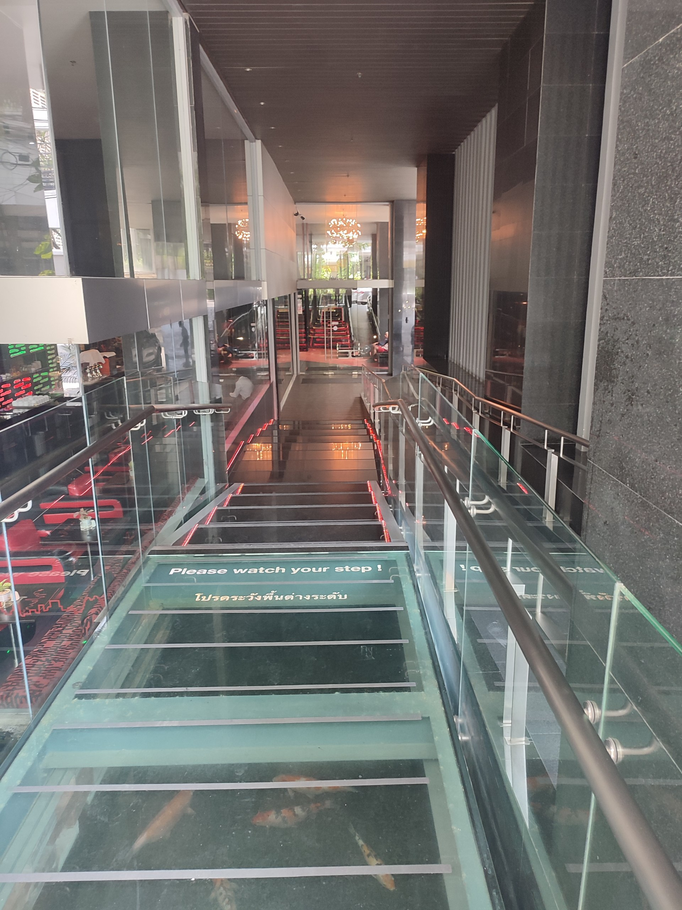
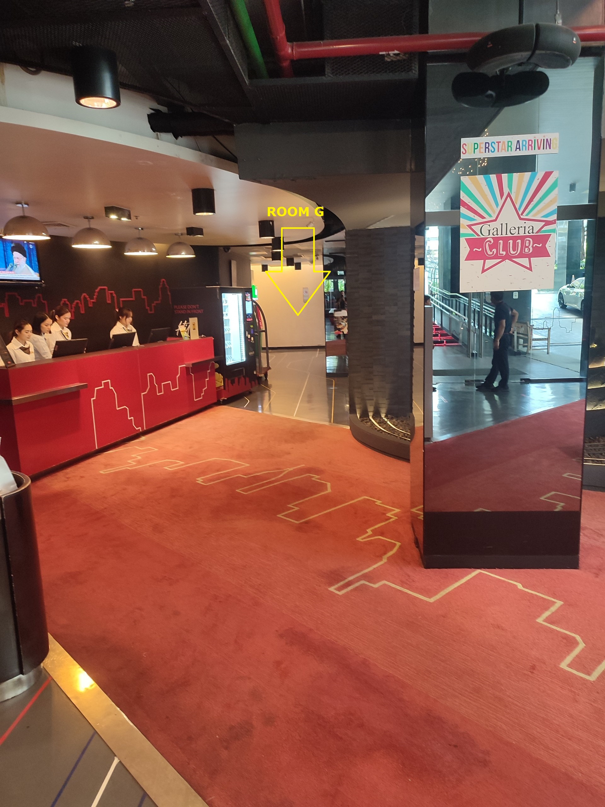

# TEMP \[#TIOF] Training Bytes 2026-02-08 JAKARTA





## About

On the occasion IETF 122 happening in Bangkok, Thailand, The IO Foundation organizes a training session on the topic of standard developing organizations (SDOs) and to explore the IETF 122 meeting and its activities.



## Registration


[🎫 **REGISTER**](https://short.theiofoundation.org/tiof-training-bytes-2025-03-registration)







{% column width="50%" %}
## Information

This Training Bytes session focuses on practical approaches for developing and implementing technical standards that enhance user safety and privacy.

Participants will

* learn about standards development organizations (SDOs) and how they influence technology
* identify areas where standards can improve user protection
* learn which standards are relevant for your industry or occupation
* explore effective strategies for engaging with key SDOs through the [Data-Centric Digital Rights framework](https://tiof.click/DCDRFrameworkDocs)
* learn how to actively participate in the upcoming [IETF 122 meeting](https://www.ietf.org/meeting/122/)

The session aims to equip attendees with the knowledge and tools necessary to contribute to standards that prioritize user rights in the global digital landscape.


{% column width="50%" %}
## COME MEET THEM

<table data-view="cards"><thead><tr><th></th><th></th><th></th><th data-hidden data-card-cover data-type="files"></th></tr></thead><tbody><tr><td>Kim Davies</td><td>Vice President, IANA Services</td><td><em>ICANN</em></td><td><a href="../../../.gitbook/assets/Grayscaleimage52628.png">Grayscaleimage52628.png</a></td></tr><tr><td>Olaf Kolkman</td><td>Principal - Internet Technology, Policy, and Advocacy</td><td><em>Internet Society</em></td><td><a href="../../../.gitbook/assets/Grayscaleimage79051.png">Grayscaleimage79051.png</a></td></tr><tr><td>Christine Runnegar</td><td>Senior Director, Internet Trust</td><td><em>Internet Society</em></td><td><a href="../../../.gitbook/assets/Christine.png">Christine.png</a></td></tr><tr><td>Lisa Dusseault</td><td>Chief Technology Officer (CTO)</td><td><em>Data Transfer Initiative</em></td><td><a href="../../../.gitbook/assets/Grayscaleimage84647.png">Grayscaleimage84647.png</a></td></tr><tr><td>Jean F. Queralt</td><td>Founder &#x26; CEO</td><td><em>The IO Foundation</em></td><td><a href="../../../.gitbook/assets/[TIOF] Avatar.png">[TIOF] Avatar.png</a></td></tr></tbody></table>




## Modalities

<table data-view="cards"><thead><tr><th></th><th></th></tr></thead><tbody><tr><td>CATEGORY 1</td><td>In-Person | Sponsored</td></tr><tr><td>CATEGORY 2</td><td>In-Person | Self-Founded</td></tr><tr><td>CATEGORY 3</td><td>Online | Sponsored</td></tr></tbody></table>


<table data-view="cards"><thead><tr><th></th><th></th><th></th><th data-hidden data-card-cover data-type="files"></th></tr></thead><tbody><tr><td>Kim Davies</td><td>Vice President, IANA Services</td><td><em>ICANN</em></td><td><a href="../../../.gitbook/assets/Grayscaleimage52628.png">Grayscaleimage52628.png</a></td></tr><tr><td>Olaf Kolkman</td><td>Principal - Internet Technology, Policy, and Advocacy</td><td><em>Internet Society</em></td><td><a href="../../../.gitbook/assets/Grayscaleimage79051.png">Grayscaleimage79051.png</a></td></tr><tr><td>Christine Runnegar</td><td>Senior Director, Internet Trust</td><td><em>Internet Society</em></td><td><a href="../../../.gitbook/assets/Christine.png">Christine.png</a></td></tr><tr><td>Lisa Dusseault</td><td>Chief Technology Officer (CTO)</td><td><em>Data Transfer Initiative</em></td><td><a href="../../../.gitbook/assets/Grayscaleimage84647.png">Grayscaleimage84647.png</a></td></tr><tr><td>Jean F. Queralt</td><td>Founder &#x26; CEO</td><td><em>The IO Foundation</em></td><td><a href="../../../.gitbook/assets/[TIOF] Avatar.png">[TIOF] Avatar.png</a></td></tr></tbody></table>



Participants will receive an e-Certificate that can be embedded and verified via our [Certificates.TheIOFoundation.org](https://certificates.theiofoundation.org) platform.


\
**Standards Developing Organizations in this activity**

* Internet Engineering Task Force ([IETF](https://www.ietf.org/))
* International Telecommunication Union ([ITU](https://www.itu.int/en/Pages/default.aspx) | [ITU-T](https://www.itu.int/ITU-T/))
* Internet Corporation for Assigned Names and Numbers ([ICANN](https://www.icann.org/))

## Fellowship opportunity


If you:

* Are in Bangkok during IETF 122
* Are a full-time student

you should consider submitting to our [\[#TIOF\] Fellowship - IETF 122](https://short.theiofoundation.org/ietf-ietf-122-info) opportunity!


## Activity Details

<table><thead><tr><th width="210"></th><th></th></tr></thead><tbody><tr><td>📢 <strong>Title</strong></td><td>Strategies to protect users through standards</td></tr><tr><td><strong>📖 Activity Type</strong></td><td>Training Bytes</td></tr><tr><td>📚 <strong>Series</strong></td><td>Rights By Design</td></tr><tr><td><strong>📅 Date Start</strong></td><td>Saturday 15th March - 09:00 (UTC+07)</td></tr><tr><td>📅 <strong>Date End</strong></td><td>Saturday 15th March - 16:30 (UTC+07)</td></tr><tr><td><a href="https://maps.app.goo.gl/rJy6LXpuWgWwKtFn8"><strong>📍</strong></a> <strong>Location</strong></td><td><a href="https://maps.app.goo.gl/wo1FSYCNj4CtsyV36">Galleria 10 Bangkok hotel</a><br>Bangkok, Thailand</td></tr><tr><td>💵 Price</td><td>$ 150 (<strong>Sponsored</strong>)</td></tr><tr><td>🎫 <strong>RSVP</strong></td><td><a href="https://short.theiofoundation.org/tiof-training-bytes-2025-03-registration">🎫 <strong>REGISTER</strong></a> <strong>(Note: cost is fully sponsored for this activity.)</strong></td></tr></tbody></table>

## Venue

The activity will take place in [Galleria 10 Bangkok hotel](https://maps.app.goo.gl/wo1FSYCNj4CtsyV36), Bangkok, Thailand.

### How to reach the venue

As you reach the hotel, follow down the stairs/ramp to reach the lobby.

<div align="left"><figure><figcaption></figcaption></figure></div>

Once at the lobby, walk all the way until the end of it and you'll find the Room Meeting G.

<div align="left"><figure><figcaption></figcaption></figure></div>

## Food & Beverage

During the event, the following will be provided:

* 2 break snacks
* Lunch

## Resources



```
 RESOURCE MATERIALS ARE BEING PUBLISHED DURING THE EVENT.
```

| Organization                                                                              | Topic                                                                                                                                   | Notes                                                                                                                                             |
| ----------------------------------------------------------------------------------------- | --------------------------------------------------------------------------------------------------------------------------------------- | ------------------------------------------------------------------------------------------------------------------------------------------------- |
| <p><a href="https://theiofoundation.org">The IO Foundation<br>(TIOF)</a></p>              | [Code of Conduct](https://tiof.click/TIOFPolicyCoC)                                                                                     | Code of Conduct for all TIOF activities.                                                                                                          |
|                                                                                           | [Dhatham House Rule](https://tiof.click/Dhatham)                                                                                        | A digital adaptation of the Chatham House Rule.                                                                                                   |
|                                                                                           | [Data-Centric Digital Rights (DCDR)](https://tiof.click/DCDRDocs)                                                                       | Information on The IO Foundation's advocacy.                                                                                                      |
|                                                                                           | [Presentation Slides](https://docs.google.com/presentation/d/1SCbSytfnlOcSGVxTSC8TLqQI2cX-e-fTz3Sd8KUPgb4/edit?usp=sharing)             |                                                                                                                                                   |
|                                                                                           | [The Selfish Ledger](https://www.youtube.com/watch?v=QDVVo14A_fo)                                                                       | A must-watch short video on how the importance of data, how companies decide to extract it and (most importantly) what they decide to do with it. |
| [Internet Corporation of Assigned Names and Numbers (ICANN)](https://www.icann.org/)      | [ICANN Policy](https://www.icann.org/policy)                                                                                            | Learn how to participate in ICANN Policy Development Processes (PDPs)                                                                             |
|                                                                                           | [ICANN for Beginners](https://www.icann.org/en/beginners)                                                                               | A good starting point for anyone wanting to participate in ICANN processes.                                                                       |
|                                                                                           | [Board of Directors](https://itp.cdn.icann.org/en/files/about-the-board/getting-to-know-the-icann-board-of-directors-16-08-2022-en.pdf) | Infographic depicting the composition of the ICANN Board.                                                                                         |
| [Internet Assigned Numbers Authority (IANA)](https://www.iana.org/)                       | [Attending a KSK Ceremony](https://www.iana.org/help/key-ceremony-attendance)                                                           | Information to participate on a KSK Ceremony.                                                                                                     |
|                                                                                           | [Call for volunteers as Trusted Community Representatives](https://www.iana.org/help/tcr-application)                                   |                                                                                                                                                   |
|                                                                                           | [Root KSK Ceremony](https://www.youtube.com/@iana-org/streams)                                                                          | Recordings of previous KSK Ceremonies.                                                                                                            |
| <p><a href="https://www.internetsociety.org/">Internet Society<br>(ISOC)</a></p>          | [Becoming a member](https://www.internetsociety.org/become-a-member/)                                                                   | Information on how to become an ISOC individual member.                                                                                           |
|                                                                                           | [Network and Distributed](https://www.ndss-symposium.org/)                                                                              |                                                                                                                                                   |
| <p><br>System Security (NDSS) Symposium</p>                                               |                                                                                                                                         |                                                                                                                                                   |
|                                                                                           | [Pulse](https://pulse.internetsociety.org/)                                                                                             | ISOC project to evaluate the availability, evolution, and resilience of the global Internet.                                                      |
|                                                                                           | [2025 Action Plan](https://www.internetsociety.org/wp-content/uploads/2024/11/2025-Action-Plan-EN.pdf)                                  | Learn what is ISOC up to during 2025.                                                                                                             |
| [Internet Engineering Task Force (IETF)](https://www.ietf.org/)                           | [IETF 122](https://www.ietf.org/meeting/122/) ([**Registration**](https://registration.ietf.org/122/))                                  |                                                                                                                                                   |
|                                                                                           | [Datatracker](https://datatracker.ietf.org/)                                                                                            | Centralized repository of all things IETF.                                                                                                        |
|                                                                                           | [Ornithology PDF](https://internetsociety.github.io/IETF-Ornithology/IETF-Ornithology.pdf)                                              |                                                                                                                                                   |
|                                                                                           | [NomCom](https://www.ietf.org/about/groups/nomcom/)                                                                                     | Information on the Nominating Commitee.                                                                                                           |
| [International Telecommunications Union (ITU)](https://www.itu.int/en/Pages/default.aspx) | [Telecommunication Standardization (ITU-T)](https://www.itu.int/en/ITU-T/Pages/default.aspx)                                            |                                                                                                                                                   |
|                                                                                           | [Study Groups (2025-2028)](https://www.itu.int/en/ITU-T/studygroups/2025-2028/Pages/default.aspx)                                       | List of ITU-T Study Groups for the Study Cycle 2025-2028.                                                                                         |
|                                                                                           |                                                                                                                                         |                                                                                                                                                   |
| [World Wide Web Consortium (W3C)](https://www.w3.org/)                                    | [Get involved](https://www.w3.org/get-involved/)                                                                                        | Information on getting involved in W3C work.                                                                                                      |
|                                                                                           |                                                                                                                                         |                                                                                                                                                   |
|                                                                                           |                                                                                                                                         |                                                                                                                                                   |



| Content           | (short)URL                                                                                                                                               | QR Code                                                                                    |
| ----------------- | -------------------------------------------------------------------------------------------------------------------------------------------------------- | ------------------------------------------------------------------------------------------ |
| Info Page         | [https://Short.TheIOFoundation.org/tiof-training-bytes-2025-03-info](https://short.theiofoundation.org/tiof-training-bytes-2025-03-info)                 |  |
| Registration Page | [https://Short.TheIOFoundation.org/tiof-training-bytes-2025-03-registration](https://short.theiofoundation.org/tiof-training-bytes-2025-03-registration) |      |
|                   |                                                                                                                                                          |                                                                                            |



| Platform                                                                                                  | URLs                                                                                                                                                                                                                                                                                                                                                                                                                                                                                                                                                                                                                                                                                                                                                                                                                                                                                                                                                 |
| --------------------------------------------------------------------------------------------------------- | ---------------------------------------------------------------------------------------------------------------------------------------------------------------------------------------------------------------------------------------------------------------------------------------------------------------------------------------------------------------------------------------------------------------------------------------------------------------------------------------------------------------------------------------------------------------------------------------------------------------------------------------------------------------------------------------------------------------------------------------------------------------------------------------------------------------------------------------------------------------------------------------------------------------------------------------------------- |
|                            | <p><a href="https://x.com/JFQueralt/status/1892098256747831379">https://x.com/JFQueralt/status/1892098256747831379</a><br><br><a href="https://x.com/TheIOFoundation/status/1892096654167171225">https://x.com/TheIOFoundation/status/1892096654167171225</a><br><br><a href="https://x.com/TheIOFoundation/status/1897493815100879013">https://x.com/TheIOFoundation/status/1897493815100879013</a></p>                                                                                                                                                                                                                                                                                                                                                                                                                                                                                                                                             |
|   | <p><a href="https://www.linkedin.com/feed/update/urn:li:share:7297859815932862464/">https://www.linkedin.com/feed/update/urn:li:share:7297859815932862464/</a><br><br><a href="https://www.linkedin.com/feed/update/urn:li:activity:7297797056872488960/">https://www.linkedin.com/feed/update/urn:li:activity:7297797056872488960/</a><br><br><a href="https://www.linkedin.com/feed/update/urn:li:share:7297860704349364225/?actorCompanyId=8703611">https://www.linkedin.com/feed/update/urn:li:share:7297860704349364225/?actorCompanyId=8703611</a><br><br><a href="https://www.linkedin.com/feed/update/urn:li:share:7303261821161943040/">https://www.linkedin.com/feed/update/urn:li:share:7303261821161943040/</a><br><br><a href="https://www.linkedin.com/feed/update/urn:li:share:7303641791117807617/?actorCompanyId=8703611">https://www.linkedin.com/feed/update/urn:li:share:7303641791117807617/?actorCompanyId=8703611</a><br></p> |
|         | <p><a href="https://www.facebook.com/TheI0Foundation/posts/1058170059687497">https://www.facebook.com/TheI0Foundation/posts/1058170059687497</a><br></p>                                                                                                                                                                                                                                                                                                                                                                                                                                                                                                                                                                                                                                                                                                                                                                                             |
|  | <p><a href="https://www.instagram.com/p/DG1_g-PJ1n9/">https://www.instagram.com/p/DG1_g-PJ1n9/</a><br></p>                                                                                                                                                                                                                                                                                                                                                                                                                                                                                                                                                                                                                                                                                                                                                                                                                                           |
|    |                                                                                                                                                                                                                                                                                                                                                                                                                                                                                                                                                                                                                                                                                                                                                                                                                                                                                                                                                      |
|                                                                                                           |                                                                                                                                                                                                                                                                                                                                                                                                                                                                                                                                                                                                                                                                                                                                                                                                                                                                                                                                                      |





{% column width="58.333333333333336%" %}
## About

The IO Foundation, a tech NGO, is seeking passionate and dedicated individuals to join our cohort of Fellows for the upcoming [Asia Pacific Regional Internet Conference on Operational Technologies (APRICOT 2026](https://2026.apricot.net/#/)), to be held in Jakarta (Indonesia) from 5th to 12th February 2026.


## NOTICE

Please note that the \[#TIOF] TU Fellowship APRICOT 2026 will run on slightly different dates than APRICOT 2026.

Check the [Timeline](temp-tiof-training-bytes-2026-02-08-jakarta.md#timeline) below for more details.


This is a major annual technical conference which brings together internet engineers, operators, researchers and policymakers to share knowledge and discuss the future of the Internet in the Asia-Pacific region through technical sessions, workshops and tutorials.

The Fellowship will include:

* **A** [**Training Bytes session**](tiof-training-bytes-2026-02-08-jakarta.md) **that will take place on Sunday, 8th February 2026**
* **Attendance to the conference part of APRICOT 2026, which will be conducted from Monday, 9th to Wednesday, 11th February 2026.**

### Why join this Fellowship?

TIOF Fellows represent The IO Foundation on an international stage while contributing to advancing the Data-Centric Digital Rights (DCDR) advocacy by actively engaging in Standards Developing Organizations (SDOs) with their communities and the technical standards they produce.

As a Fellow, you'll be a member of a growing network of technologists working towards ensuring that technology protects citizens by design.


{% column width="41.666666666666664%" %}
<p align="center"><a href="https://short.theiofoundation.org/TIOF-TU-Fellowship-APRICOT-2026-Registration" class="button primary" data-icon="tickets">REGISTER NOW</a></p>

<div align="center"><figure><figcaption></figcaption></figure></div>


## **SUBMISSION DEADLINE**

**5TH JANUARY 2026**

**23:59 (UTC+00)**



## FELLOWSHIP ANNOUNCEMENT

**FRIDAY, 9TH JANUARY 2026**



## WHO CAN APPLY?

Open to full-time students and lecturers in relevant fields\
(e.g., Networking, Protocols, Standards, Cyber Security, etc.)

* Note that proof of student status will need to be submitted



## RELATED EVENT

[**\[#APNOG\] APRICOT 2026**](apnog-apricot-2026/)




## Modalities

Participation in this Fellowship can be done through the following modalities:

<table data-view="cards"><thead><tr><th></th><th></th></tr></thead><tbody><tr><td>CATEGORY 1</td><td>In-Person | Sponsored</td></tr><tr><td>CATEGORY 2</td><td>In-Person | Self-Founded</td></tr></tbody></table>

## Who will you meet


{% column width="41.66666666666667%" %}
Participating in this Fellowship will grant you the opportunity to being trained and guided in your career development by prominent figures in the Network Operators sector and the broader Standards Development Organizations ecosystem.


## NOTICE

Please note that we are  currently finalizing the guest list for this Fellowship.

The information will be updated in this page in the coming days.

Registered candidates will also be updated via email.



{% column width="58.33333333333333%" %}
<table data-view="cards"><thead><tr><th></th><th></th><th></th><th data-hidden data-card-cover data-type="image">Cover image</th></tr></thead><tbody><tr><td>Christopher Locke</td><td>Managing Director </td><td><em>Internet Society Foundation</em></td><td><a href="../../../.gitbook/assets/Copy of Gitbook Card.png">Copy of Gitbook Card.png</a></td></tr><tr><td>Olaf Kolkman</td><td>Principal - Internet Technology, Policy, and Advocacy</td><td><em>Internet Society</em></td><td><a href="../../../.gitbook/assets/Grayscaleimage79051.png">Grayscaleimage79051.png</a></td></tr><tr><td>Jean F. Queralt</td><td>Founder &#x26; CEO</td><td><em>The IO Foundation</em></td><td><a href="../../../.gitbook/assets/[TIOF] Avatar.png">[TIOF] Avatar.png</a></td></tr><tr><td><strong>MORE TO COME!</strong></td><td></td><td></td><td><a href="../../../.gitbook/assets/[TIOF] Comms [P] 0000-00-00 TIOF Card More Speakers XXX v1.0.png">[TIOF] Comms [P] 0000-00-00 TIOF Card More Speakers XXX v1.0.png</a></td></tr></tbody></table>




## LIMITED SPOTS

**APPLY BY MONDAY 5th JANUARY 2026 23:59 (UTC+00)**   <a href="https://short.theiofoundation.org/TIOF-TU-Fellowship-APRICOT-2026-Registration" class="button primary" data-icon="tickets">REGISTER NOW</a>


## **Terms of Reference**

**Applicants must understand and abide by the following:**



### **Requirements**

* [x] Located in Jakarta for the duration of the Fellowship


## CLARIFICATION

You _**do not**_ need to live in Jakarta or be a resident of Indonesia: you need to be in Jakarta during:

* Training Bytes 2026-02: Sunday 8th February 2026
* APRICOT 2026 conference: Monday 9th to Wednesday 11th February 2026


* [x] Ability to work independently and collaboratively in dynamic environments





* [x] Passion for and commitment to The IO Foundation's [mission](https://tiof.click/TIOFMission) and [values](https://tiof.click/TIOFValues)
* [x] **Languages**

- English fluent both oral and written
- Fluent level of local official languages is a plus.

* [x] Strong networking skills and a proactive approach to building relationships within the tech community will be a plus.
* [x] Strong understanding of data privacy and technology issues will be a plus.
* [x] Proven experience in event participation, public speaking or advocacy will be a plus.






### Responsibilities

By becoming a Fellow you commit to the following responsibilities:

* [x] Actively participate in the following events and activities related to this Fellowship:

- [\[#TIOF\] Training Bytes 2026-02-08 JAKARTA](tiof-training-bytes-2026-02-08-jakarta.md)
- [\[#APNOG\] APRICOT 2026](apnog-apricot-2026/)

* [x] Submit your Fellowship Report before the deadline (see [Timeline](temp-tiof-training-bytes-2026-02-08-jakarta.md#timeline)).



###

* [x] Provide regular reports on participation during the Fellowship, including insights, outcomes and recommendations for future engagements.
* [x] Collaborate with other TIOF Members to enhance the impact of our advocacy efforts.
* [x] Act as a responsibly and in accordance to both [TIOF's Code of Conduct](https://short.theiofoundation.org/TIOFPolicyCoC) and [APRICOT's Code of Conduct](https://www.apricot.net/ops/conduct.html).\
  Being a TIOF Fellow implies representing The IO Foundation and effectively communicating our mission, values and initiatives.



## Benefits

By participating in this Fellowship, you will enjoy the following benefits:



* [x] Learn about how the Internet works at a practical, professional level directly from the community that makes the Internet possible in the APAC region.
* [x] Expand your career options.
* [x] Free access to the event:\
  [\[#TIOF\] Training Bytes 2026-02-08 JAKARTA](tiof-training-bytes-2026-02-08-jakarta.md)\
  **Price:** USD 150 **`Ticket waived`**
* [x] Free access to the event:\
  [\[#APNOG\] APRICOT 2026](apnog-apricot-2026/)\
  **Price:** USD 350 **`Ticket waived`**
* [x] Networking:
  * [x] Meet and greet with all the speakers and VIPs attending [\[#TIOF\] Training Bytes 2026-02-08 JAKARTA](tiof-training-bytes-2026-02-08-jakarta.md)
  * [x] Attend socials & networking sessions during [\[#APNOG\] APRICOT 2026](apnog-apricot-2026/).
* [x] TIOF Welcome Pack (includes exclusive TIOF Fellow t-shirt)



* [x] Blockchain based certificate of participation in TIOF Fellowship (check our [Certificates.TheIOFoundation.org](http://certificates.theiofoundation.org) platform), will be given on:
  * [ ] Fully completion of conference session attendance
  * [ ] \[#TIOF] Training Bytes and follow up evaluation/ feedback sessions
* [x] Access to the The IO Foundation's _TechUp Community_ where you'll be able to enhance your knowledge and career opportunities:
  * [x] Access to exclusive training by TIOF
  * [x] Priority for next Fellowship opportunities
  * [x] Stay informed on current trends and developments in technology and data privacy to contribute to discussions and strategic planning.
  * [x] Participate in monthly TechUp Community meetings.



## Timeline



**16/12/2025: Opening of applications**&#x20;

Submit your interest! Make sure to read the [Requirements](temp-tiof-training-bytes-2026-02-08-jakarta.md#requirements) and understand the [Responsibilities](temp-tiof-training-bytes-2026-02-08-jakarta.md#responsibilities).\
<a href="https://short.theiofoundation.org/TIOF-TU-Fellowship-APRICOT-2026-Registration" class="button primary" data-icon="tickets">REGISTER NOW</a>



**05/01/26: Closing of applications**

Applications will not be accepted beyond this date (UTC + 00).



**09/01/26: Announcement of the cohort**

TIOF will announce the final list of the cohort.



**08/02/26: Training Bytes session**

The cohort will gather for an orientation session.



**09/02/2026 to 12/02/2026: APRICOT 2026**

Participate in the event with the full support of the TIOF team onsite.



**18/02/26: Submission of Assignment**

Submit your Fellowship Report for evaluation.



**19/02/26: Review call**

The cohort will meet for an online session where we will discuss feedback and explore next steps and opportunities.



**28/02/2026: Issuing of digital certificates**

Fellows who have successfully completed the [Fellowship Requirements](temp-tiof-training-bytes-2026-02-08-jakarta.md#requirements) will receive a digital certificate as a proof of completion.




## LIMITED SPOTS

**APPLY BY MONDAY 5th JANUARY 2026 23:59 (UTC+00)**   <a href="https://short.theiofoundation.org/TIOF-TU-Fellowship-APRICOT-2026-Registration" class="button primary" data-icon="tickets">REGISTER NOW</a>


## Acknowledgements



### Sponsors

<table data-view="cards"><thead><tr><th></th><th></th><th data-hidden data-card-cover data-type="image">Cover image</th></tr></thead><tbody><tr><td>Would you like to support technologists in their career towards protecting users?</td><td><a href="mailto:Contact@TheIOFoundation.org">Reach out!</a></td><td><a href="../../../.gitbook/assets/[TIOF] Comms [P] 0000-00-00 TIOF Card Sponsors CTA XXX v1.0.png">[TIOF] Comms [P] 0000-00-00 TIOF Card Sponsors CTA XXX v1.0.png</a></td></tr></tbody></table>



### Partners

<table data-view="cards"><thead><tr><th></th><th></th><th data-hidden data-card-cover data-type="image">Cover image</th></tr></thead><tbody><tr><td>Would you like to partner with us in our Fellowships?</td><td><a href="mailto:Contact@TheIOFoundation.org">Reach out!</a></td><td><a href="../../../.gitbook/assets/[TIOF] Comms [P] 0000-00-00 TIOF Card Partners CTA XXX v1.0.png">[TIOF] Comms [P] 0000-00-00 TIOF Card Partners CTA XXX v1.0.png</a></td></tr></tbody></table>



## Sponsorship Opportunities

<table data-card-size="large" data-view="cards"><thead><tr><th></th><th></th><th></th><th data-hidden data-card-cover data-type="image">Cover image</th></tr></thead><tbody><tr><td><strong>Support Fellows</strong></td><td>Would you like to support technologists in their career towards protecting users?</td><td><a href="mailto:Contact@TheIOFoundation.org">Reach out!</a></td><td><a href="../../../.gitbook/assets/[TIOF] Comms [P] 0000-00-00 TIOF Card Partners CTA XXX v1.0 (2).png">[TIOF] Comms [P] 0000-00-00 TIOF Card Partners CTA XXX v1.0 (2).png</a></td></tr><tr><td><strong>Support The IO Foundation</strong></td><td>Would you like to support The IO Foundation in its advocacy towards a Rights-by-Design digital ecosystem?</td><td><a href="mailto:Contact@TheIOFoundation.org">Reach out!</a></td><td data-object-fit="contain"><a href="../../../.gitbook/assets/[TIOF] Comms [P] Favicon XXX v1.0.png">[TIOF] Comms [P] Favicon XXX v1.0.png</a></td></tr></tbody></table>

## Share this opportunity


{% column width="83.33333333333334%" %}
Help spreading the word about this Fellowship opportunity.

Here's a suggested text:


```
⚡ Check out this @TUFellowship opportunity from @TheIOFoundation to attend #APRICOT2026!

🎫 Register now at https://short.theiofoundation.org/TIOF-TU-Fellowship-APRICOT-2026-Registration

📅 Deadline: 5TH JANUARY 2026

More information:
https://discover.theiofoundation.org/activities/upcoming-seasons/season-2026/02-february/tiof-tu-fellowship-apricot-2026
```





{% column width="16.666666666666657%" %}
<table data-view="cards"><thead><tr><th></th><th data-hidden data-card-cover data-type="image">Cover image</th><th data-hidden data-card-target data-type="content-ref"></th></tr></thead><tbody><tr><td></td><td data-object-fit="contain"><a href="../../../.gitbook/assets/Twitter X Icon.png">Twitter X Icon.png</a></td><td><a href="https://twitter.com/intent/tweet?text=%E2%9A%A1%20Check%20out%20this%20%40TUFellowship%20opportunity%20from%20%40TheIOFoundation%20to%20attend%20%23APRICOT2026!%0A%0A%F0%9F%8E%AB%20Register%20now%20at%20https%3A%2F%2Fshort.theiofoundation.org%2FTIOF-TU-Fellowship-APRICOT-2026-Registration%0A%0A%F0%9F%93%85%20Deadline%3A%205TH%20JANUARY%202026%0A%0AMore%20information%3A%0Ahttps%3A%2F%2Fdiscover.theiofoundation.org%2Factivities%2Fupcoming-seasons%2Fseason-2026%2F02-february%2Ftiof-tu-fellowship-apricot-2026">https://twitter.com/intent/tweet?text=%E2%9A%A1%20Check%20out%20this%20%40TUFellowship%20opportunity%20from%20%40TheIOFoundation%20to%20attend%20%23APRICOT2026!%0A%0A%F0%9F%8E%AB%20Register%20now%20at%20https%3A%2F%2Fshort.theiofoundation.org%2FTIOF-TU-Fellowship-APRICOT-2026-Registration%0A%0A%F0%9F%93%85%20Deadline%3A%205TH%20JANUARY%202026%0A%0AMore%20information%3A%0Ahttps%3A%2F%2Fdiscover.theiofoundation.org%2Factivities%2Fupcoming-seasons%2Fseason-2026%2F02-february%2Ftiof-tu-fellowship-apricot-2026</a></td></tr><tr><td></td><td data-object-fit="contain"><a href="../../../.gitbook/assets/[TIOF] Comms [P] Icon LinkedIn XXX v1.0.png">[TIOF] Comms [P] Icon LinkedIn XXX v1.0.png</a></td><td><a href="https://www.linkedin.com/sharing/share-offsite/?url=https%3A%2F%2Fdiscover.theiofoundation.org%2Factivities%2Fupcoming-seasons%2Fseason-2026%2F02-february%2Ftiof-tu-fellowship-apricot-2026">https://www.linkedin.com/sharing/share-offsite/?url=https%3A%2F%2Fdiscover.theiofoundation.org%2Factivities%2Fupcoming-seasons%2Fseason-2026%2F02-february%2Ftiof-tu-fellowship-apricot-2026</a></td></tr><tr><td></td><td data-object-fit="contain"><a href="../../../.gitbook/assets/[TIOF] Comms [P] Icon FB XXX v1.0.png">[TIOF] Comms [P] Icon FB XXX v1.0.png</a></td><td><a href="https://www.facebook.com/sharer/sharer.php?u=https%3A%2F%2Fdiscover.theiofoundation.org%2Factivities%2Fupcoming-seasons%2Fseason-2026%2F02-february%2Ftiof-tu-fellowship-apricot-2026&#x26;quote=%E2%9A%A1%20Check%20out%20this%20%40TUFellowship%20opportunity%20from%20%40TheIOFoundation%20to%20attend%20%23APRICOT2026!%0A%0A%F0%9F%8E%AB%20Register%20now%20at%20https%3A%2F%2Fshort.theiofoundation.org%2FTIOF-TU-Fellowship-APRICOT-2026-Registration%0A%0A%F0%9F%93%85%20Deadline%3A%205TH%20JANUARY%202026">https://www.facebook.com/sharer/sharer.php?u=https%3A%2F%2Fdiscover.theiofoundation.org%2Factivities%2Fupcoming-seasons%2Fseason-2026%2F02-february%2Ftiof-tu-fellowship-apricot-2026&#x26;quote=%E2%9A%A1%20Check%20out%20this%20%40TUFellowship%20opportunity%20from%20%40TheIOFoundation%20to%20attend%20%23APRICOT2026!%0A%0A%F0%9F%8E%AB%20Register%20now%20at%20https%3A%2F%2Fshort.theiofoundation.org%2FTIOF-TU-Fellowship-APRICOT-2026-Registration%0A%0A%F0%9F%93%85%20Deadline%3A%205TH%20JANUARY%202026</a></td></tr></tbody></table>





## Media

Media taken during the Fellowship will be posted here.



```
PHOTOS TAKEN DURING THIS FELLOWSHIP WILL BE POSTED HERE.
```



```
VIDEOS TAKEN DURING THIS FELLOWSHIP WILL BE POSTED HERE.
```




## Frequently Asked Questions

<details>

<summary>Let us answer any doubts you may have.</summary>

<i class="fa-circle-question">:circle-question:</i> Is this Fellowship opportunity free?

<i class="fa-circle-a">:circle-a:</i> Yes


</details>

## Resources



```
 RESOURCE MATERIALS WILL BE PUBLISHED AFTER THE EVENT.
```





```
 RESOURCE MATERIALS WILL BE PUBLISHED AFTER THE EVENT.
```



## Attributions

Photos by

* [David Kristianto](https://unsplash.com/@davidkristianto?utm_source=unsplash\&utm_medium=referral\&utm_content=creditCopyText) on [Unsplash](https://unsplash.com/photos/cityscape-under-a-blue-sky-with-fluffy-clouds-Hlva-wGrTcI?utm_source=unsplash\&utm_medium=referral\&utm_content=creditCopyText)
* [Walls.io](https://unsplash.com/@walls_io?utm_source=unsplash\&utm_medium=referral\&utm_content=creditCopyText) on [Unsplash](https://unsplash.com/photos/a-close-up-of-a-paper-with-a-pen-on-it-IJRayDxr5ek?utm_source=unsplash\&utm_medium=referral\&utm_content=creditCopyText)
* [Sincerely Media](https://unsplash.com/@sincerelymedia?utm_source=unsplash\&utm_medium=referral\&utm_content=creditCopyText) on [Unsplash](https://unsplash.com/photos/person-holding-hands-of-another-person-EtyBBUByPSQ?utm_source=unsplash\&utm_medium=referral\&utm_content=creditCopyText)


Photo by [Alberto Bigoni](https://unsplash.com/@albertobigoni?utm_source=unsplash\&utm_medium=referral\&utm_content=creditCopyText) on [Unsplash](https://unsplash.com/photos/grayscale-of-man-in-dress-shirt-kvinEq5Utfw?utm_source=unsplash\&utm_medium=referral\&utm_content=creditCopyText)


