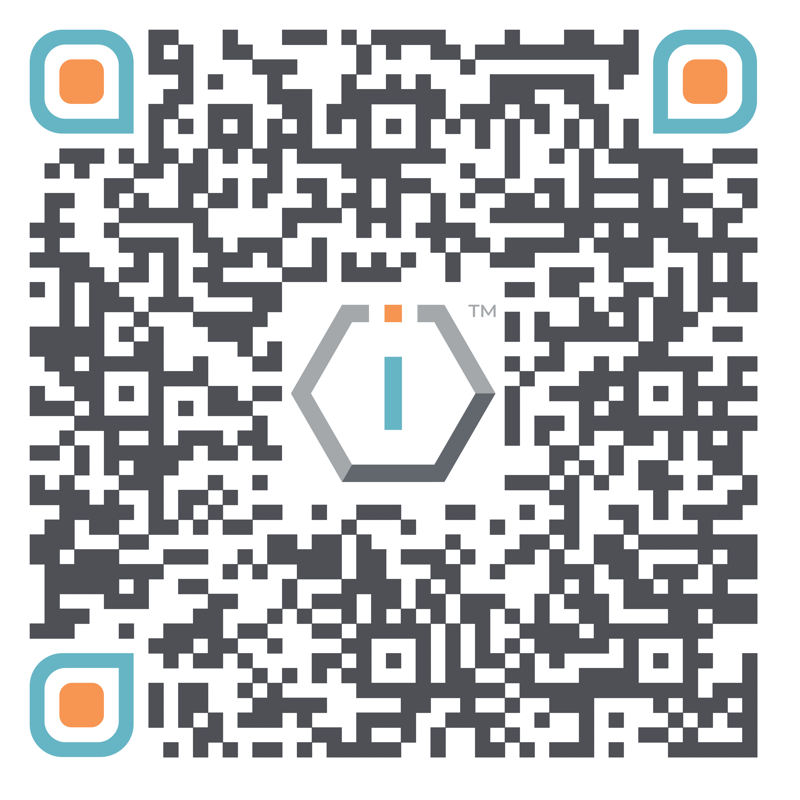
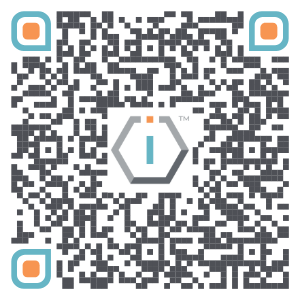

# \[#TIOF] TU Fellowship IETF 127

|                                                                                                                                        |
| :------------------------------------------------------------------------------------------------------------------------------------: |
| <a href="https://short.theiofoundation.org/tiof-fellowship-ietf-123-registration" class="button primary">? GO TO REGISTRATION FORM</a> |

<div align="center"><figure><figcaption></figcaption></figure></div>


**DEADLINE EXTENDED: APPLY BY JUNE 30th 23:59 (UTC+00)**


## About

The IO Foundation, a tech NGO, is seeking passionate and dedicated individuals to join our team as Fellows for the upcoming IETF 123 to be held in Madrid (Spain) from Saturday 19th to Friday 25th July 2025. This role offers a unique opportunity to engage in this event and is an extended activity from the Training Bytes 2025-07 that will take place on a date to be soon announced.

TIOF Fellows represent The IO Foundation on an international stage while contributing to advancing the Data-Centric Digital Rights (DCDR) advocacy by actively engaging in Standards Developing Organizations (SDOs), with their communities and the technical standards they produce.

As a Fellow, you'll be a member of a growing network of technologists working towards ensuring that technology protects citizens by design.

> **NOTE: LIMITED SPOTS - APPLY BY JUNE 30th 23:59 (UTC+00)**

## **Responsibilities**

* Actively participate in the following events and activities related to The IO Foundation?s advocacy on Data-Centric Digital Rights:
  * [\[#TIOF\] Training Bytes 2025-07](../../../../current-season/season-2025/07-july/tiof-training-bytes-2025-07-madrid.md) (Madrid, Spain)
  * [\[#IETF\] IETF 123](../../../../current-season/season-2025/07-july/ietf-ietf-123.md) (Madrid, Spain)
* Serve as a representative of The IO Foundation, effectively communicating our mission, values and initiatives
* Provide regular reports on participation, including insights, outcomes and recommendations for future engagements
* Collaborate with other TIOF Members to enhance the impact of our advocacy efforts
* Stay informed on current trends and developments in technology and data privacy to contribute to discussions and strategic planning
* Participate in monthly Fellowship meetings

## **Qualifications | Requirements**

* Located in Madrid for the duration of the Fellowship
  * **Clarification:** You _**do not**_ need to be a resident of Spain, you only need to be in Madrid (Spain) during the whole duration of the IETF 123 meeting.
* Open to full time students in relevant fields (e.g. Networking, Protocols, Standards, Cyber Security, etc.)
  * Note that proof of student status will need to be submitted
* Strong understanding of data privacy and technology issues
* Ability to work independently and collaboratively in dynamic environments
* Strong networking skills and a proactive approach to building relationships within the tech community
* Proven experience in event participation, public speaking or advocacy will be a plus
* Passion for and commitment to The IO Foundation's [mission](https://tiof.click/TIOFMission) and [values](https://tiof.click/TIOFValues)

## **Qualifications | Languages**

* English fluent both oral and written
* Fluent level of official language of country of residence is a plus

## **Terms of Reference**

* TIOF Member type: Fellow
* Engagement length: As agreed
* Time commitment: As agreed
* Benefits
  * [\[#TIOF\] Training Bytes 2025-07](../../../../current-season/season-2025/07-july/tiof-training-bytes-2025-07-madrid.md) (Madrid, Spain) - **Ticket waived**
  * [\[#IETF\] IETF 123](../../../../current-season/season-2025/07-july/ietf-ietf-123.md) (Madrid, Spain) - **Ticket waived (Student Pass)**
  * TIOF Welcome Pack (includes exclusive TIOF Fellow t-shirt)
  * Certificate of participation in TIOF Fellowship (check our [Certificates.TheIOFoundation.org](http://certificates.theiofoundation.org) platform)
  * Access to exclusive training by TIOF
  * Access to the The IO Foundation's _TechUp Community_
  * Priority for next Fellowship opportunities

|                                                                                                                                      |
| :----------------------------------------------------------------------------------------------------------------------------------: |
| <a href="https://short.theiofoundation.org/tiof-fellowship-ietf-123-registration" class="button primary">GO TO REGISTRATION FORM</a> |

<div align="center"><figure><figcaption></figcaption></figure></div>


**DEADLINE EXTENDED: APPLY BY JUNE 30th 23:59 (UTC+00)**


## Resources



```
 RESOURCE MATERIALS WILL BE PUBLISHED AFTER THE EVENT.
```



| Content           | (short)URL                                                                                                                                         | QR Code                                                                           |
| ----------------- | -------------------------------------------------------------------------------------------------------------------------------------------------- | --------------------------------------------------------------------------------- |
| Info Page         | [https://Short.TheIOFoundation.org/tiof-fellowship-ietf-123-info](https://short.theiofoundation.org/tiof-fellowship-ietf-123-info)                 |      |
| Registration Page | [https://Short.TheIOFoundation.org/tiof-fellowship-ietf-123-registration](https://short.theiofoundation.org/tiof-fellowship-ietf-123-registration) |  |
|                   |                                                                                                                                                    |                                                                                   |



| Platform                                                                                                     | URLs |
| ------------------------------------------------------------------------------------------------------------ | ---- |
|                            |      |
|   |      |
|         |      |
|  |      |
|    |      |
|                                                                                                              |      |



## Media

Media taken during the Fellowship will be posted here.
